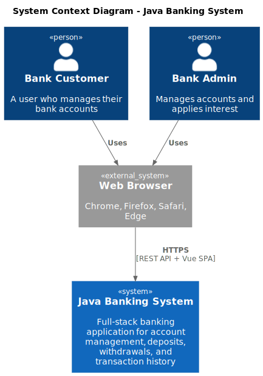

# Architecture Documentation

This documentation uses the [C4 Model](https://c4model.com/) to describe the Java Banking System architecture at different levels of abstraction.

## C4 Model Overview

| Level | Diagram | Audience | Shows |
|-------|---------|----------|-------|
| 1 | [Context](c4-context.md) | Everyone | System + users + external systems |
| 2 | [Container](c4-container.md) | Technical | Applications, databases, services |
| 3 | [Component](c4-component-backend.md) | Developers | Internal structure of containers |

## Diagrams

### Level 1: System Context

### Level 2: Container

### Level 3: Components

| Container | Diagram |
|-----------|---------|
| Backend (Spring Boot) | [View](c4-component-backend.md) |
| Frontend (Vue 3) | [View](c4-component-frontend.md) |

## Technology Stack

| Layer | Technology | Version |
|-------|------------|---------|
| Frontend | Vue 3, Vite, Tailwind CSS | 3.x, 7.x, 4.x |
| Backend | Spring Boot, Java | 3.2, 17 |
| Database | H2 (in-memory) | - |
| Container | Docker, Nginx | - |
| Testing | JUnit 5, Vitest, Playwright | - |

## Source Files

PlantUML source files are in this directory:
- `c4-context.puml`
- `c4-container.puml`
- `c4-component-backend.puml`
- `c4-component-frontend.puml`

To regenerate SVGs, use the PlantUML server at `https://plantuml.crypto1.ca`.
