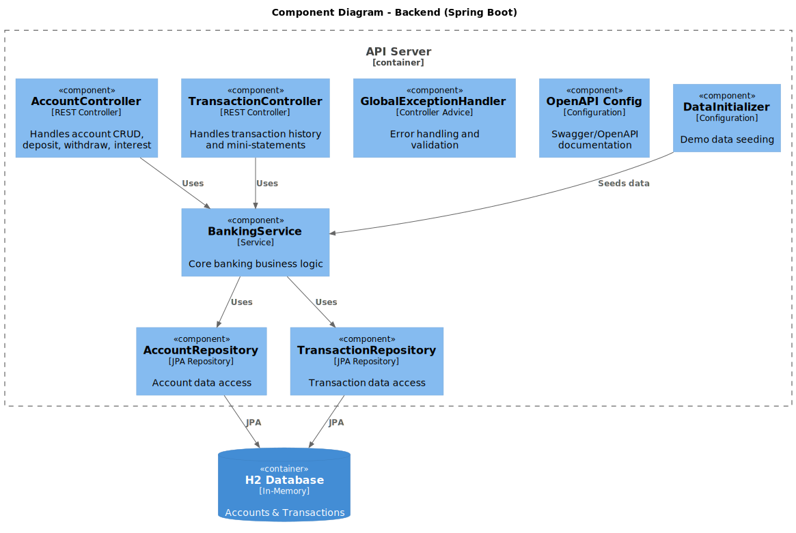

# C4 Model - Level 3: Backend Components

The Component diagram for the Spring Boot backend shows the internal structure and responsibilities.



## Components

| Component | Type | Responsibility |
|-----------|------|----------------|
| **AccountController** | REST Controller | Account CRUD, deposit, withdraw, interest |
| **TransactionController** | REST Controller | Transaction history, mini-statements |
| **BankingService** | Service | Core banking business logic |
| **AccountRepository** | JPA Repository | Account data access |
| **TransactionRepository** | JPA Repository | Transaction data access |
| **GlobalExceptionHandler** | Controller Advice | Error handling, validation errors |
| **OpenAPI Config** | Configuration | Swagger/OpenAPI documentation |
| **DataInitializer** | Configuration | Demo data seeding on startup |

## Package Structure

```
com.royalbit.banking/
├── api/
│   ├── controller/
│   │   ├── AccountController.java
│   │   ├── TransactionController.java
│   │   └── GlobalExceptionHandler.java
│   ├── dto/
│   │   ├── CreateAccountRequest.java
│   │   ├── TransactionRequest.java
│   │   └── ...Response.java
│   └── config/
│       ├── OpenApiConfig.java
│       └── DataInitializer.java
├── domain/
│   ├── Account.java
│   ├── Transaction.java
│   ├── AccountType.java
│   └── TransactionType.java
├── repository/
│   ├── AccountRepository.java
│   └── TransactionRepository.java
└── service/
    └── BankingService.java
```

## Data Flow

1. **Request** → Controller validates input via DTOs
2. **Controller** → Calls BankingService with domain objects
3. **BankingService** → Applies business rules, uses repositories
4. **Repository** → JPA/Hibernate to H2 database
5. **Response** → Controller maps to response DTOs

---

[← Container Diagram](c4-container.md) | [Next: Frontend Components →](c4-component-frontend.md)
