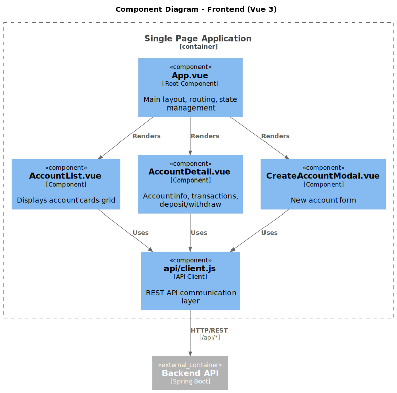

# C4 Model - Level 3: Frontend Components

The Component diagram for the Vue 3 frontend shows the UI component structure.



## Components

| Component | File | Responsibility |
|-----------|------|----------------|
| **App.vue** | `src/App.vue` | Root component, layout, state management |
| **AccountList.vue** | `src/components/` | Account cards grid display |
| **AccountDetail.vue** | `src/components/` | Account info, deposit/withdraw forms |
| **CreateAccountModal.vue** | `src/components/` | New account creation form |
| **api/client.js** | `src/api/` | REST API communication layer |

## File Structure

```
frontend/src/
├── App.vue                 # Root component
├── main.js                 # Vue app entry point
├── style.css               # Tailwind CSS imports
├── api/
│   └── client.js           # API client (fetch wrappers)
└── components/
    ├── AccountList.vue     # Account grid
    ├── AccountDetail.vue   # Account detail + transactions
    └── CreateAccountModal.vue  # Create account form
```

## State Management

Simple `ref()` state in App.vue:

| State | Type | Purpose |
|-------|------|---------|
| `accounts` | `ref([])` | All accounts list |
| `selectedAccount` | `ref(null)` | Currently selected account |
| `showCreateModal` | `ref(false)` | Modal visibility |
| `loading` | `ref(true)` | Loading state |
| `error` | `ref(null)` | Error message |

## API Client

| Function | Endpoint | Description |
|----------|----------|-------------|
| `fetchAccounts()` | GET /api/accounts | List all accounts |
| `createAccount(data)` | POST /api/accounts | Create account |
| `deposit(id, amount)` | POST /api/accounts/{id}/deposit | Deposit funds |
| `withdraw(id, amount)` | POST /api/accounts/{id}/withdraw | Withdraw funds |
| `deleteAccount(id)` | DELETE /api/accounts/{id} | Close account |
| `fetchMiniStatement(id)` | GET /api/.../mini-statement | Last 5 transactions |
| `applyInterest()` | POST /api/accounts/apply-interest | Apply 2% interest |

---

[← Backend Components](c4-component-backend.md) | [Back to Architecture →](README.md)
