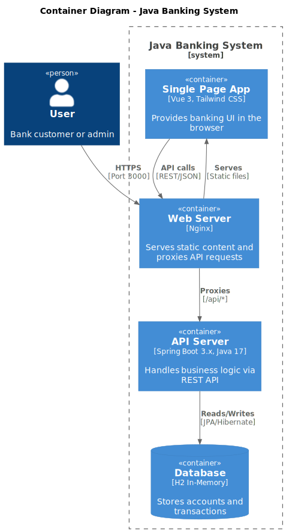

# C4 Model - Level 2: Container Diagram

The Container diagram shows the high-level technology choices and how the containers communicate.

## Containers

| Container | Technology | Purpose |
|-----------|------------|---------|
| **Single Page App** | Vue 3, Tailwind CSS | Banking UI in the browser |
| **Web Server** | Nginx | Serves static files, proxies API |
| **API Server** | Spring Boot 3.x, Java 17 | Business logic via REST API |
| **Database** | H2 In-Memory | Stores accounts and transactions |

## Communication

| From | To | Protocol | Description |
|------|-----|----------|-------------|
| User | Nginx | HTTPS | Port 3000 (Docker) |
| Nginx | SPA | File serve | Static HTML/JS/CSS |
| Nginx | API | HTTP Proxy | `/api/*` routes |
| SPA | Nginx | REST/JSON | API calls |
| API | Database | JDBC | JPA/Hibernate queries |

## Port Mapping (Docker)

| Service | Internal | External |
|---------|----------|----------|
| Frontend (Nginx) | 80 | 3000 |
| Backend (Spring) | 8080 | 8080 |

---

[← Context Diagram](c4-context.md) | [Next: Backend Components →](c4-component-backend.md)
